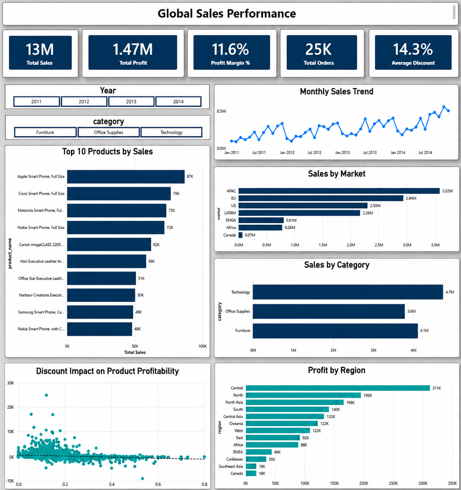

# Global-Sales-Performance-Dashboard
Interactive Business Intelligence Dashboard built using Power BI, SQL, DAX, and Power Query to analyze 51K+ global retail transactions.
# 🌍 Global Sales Performance Dashboard

Interactive Business Intelligence dashboard built using **Power BI**, **SQL**, **DAX**, and **Power Query** to analyze **51,290 global retail transactions** and deliver actionable business insights through interactive visualizations and KPI reporting.



---

# 📌 Project Overview

The objective of this project was to transform raw retail transaction data into an interactive executive dashboard for monitoring business performance across different markets, regions, product categories, and time periods.

The project demonstrates an end-to-end Business Intelligence workflow, including data exploration, KPI development, data modeling, interactive dashboard design, and business insight generation.

---

# ✨ Key Features

- Executive KPI Dashboard
- Monthly Sales Trend Analysis
- Sales by Category
- Sales by Market
- Regional Profit Analysis
- Top 10 Products by Sales
- Discount vs Profit Analysis
- Interactive Year Filter
- Interactive Category Filter
- Cross-filtering across all visuals

---

# 📊 Dashboard KPIs

- Total Sales
- Total Profit
- Total Orders
- Profit Margin
- Average Discount

---

# 📈 Business Questions Answered

- Which product category generates the highest sales?
- Which markets contribute the most revenue?
- Which regions generate the highest profit?
- Which products drive the majority of sales?
- How does sales performance change over time?
- How do discounts influence product profitability?

---

# 🛠️ Tech Stack

- Power BI
- SQL (MySQL)
- DAX
- Power Query
- Microsoft Excel

---

# 📂 Dataset Information

| Attribute | Value |
|------------|-------|
| Dataset | Global Superstore |
| Records | 51,290 |
| Time Period | 2011–2014 |
| Markets | 7 |
| Regions | 13 |
| Categories | 3 |

> This project uses the widely available **Global Superstore** dataset for Business Intelligence and Data Analytics practice.

---

# 📊 Dashboard Components

### KPI Cards

- Total Sales
- Total Profit
- Total Orders
- Profit Margin
- Average Discount

### Visualizations

- Monthly Sales Trend
- Sales by Category
- Sales by Market
- Profit by Region
- Top 10 Products by Sales
- Discount Impact on Product Profitability

### Interactive Filters

- Year
- Category

---

# 💡 Key Business Insights

- Technology products generated the highest overall sales.
- Sales performance varied significantly across different global markets.
- Regional profitability showed noticeable differences, indicating varying business performance.
- A small number of products contributed a significant portion of total sales.
- Higher discount levels generally corresponded with lower product profitability.
- Interactive filtering enables year-wise and category-wise business performance analysis.

---

# ⚙️ Power BI Concepts Used

- Data Modeling
- DAX Measures
- Power Query
- KPI Cards
- Interactive Slicers
- Cross Filtering
- Line Charts
- Bar Charts
- Scatter Plot
- Data Visualization
- Dashboard Design

---

# 🗃️ SQL Analysis

SQL was used for exploratory data analysis before dashboard development.

The SQL analysis included:

- Overall Business Summary
- Sales Analysis
- Profit Analysis
- Category-wise Performance
- Market-wise Performance
- Region-wise Performance
- Product Performance
- Discount Analysis
- Top Performing Products
- KPI Calculations

SQL queries are available in:

```text
sql/sales_analysis.sql
```

---

# 📁 Project Structure

```text
Global-Sales-Performance-Dashboard/
│
├── Global_Sales_Performance_Dashboard.pbix
├── README.md
├── data/
│   └── SuperStoreOrders.csv
├── sql/
│   └── sales_analysis.sql
└── images/
    └── dashboard-overview.png
```

---

# 🚀 Skills Demonstrated

- Business Intelligence
- Data Analysis
- Dashboard Design
- Data Visualization
- SQL
- DAX
- Power Query
- KPI Development
- Exploratory Data Analysis (EDA)
- Business Analytics

---

# 📬 Feedback

Suggestions and feedback are always welcome. Feel free to open an issue or connect to discuss improvements.
